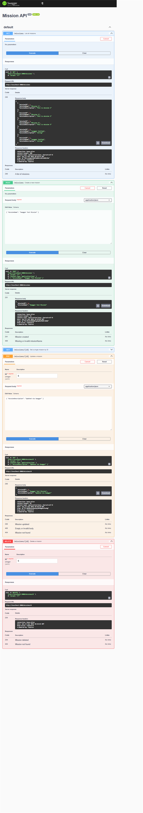
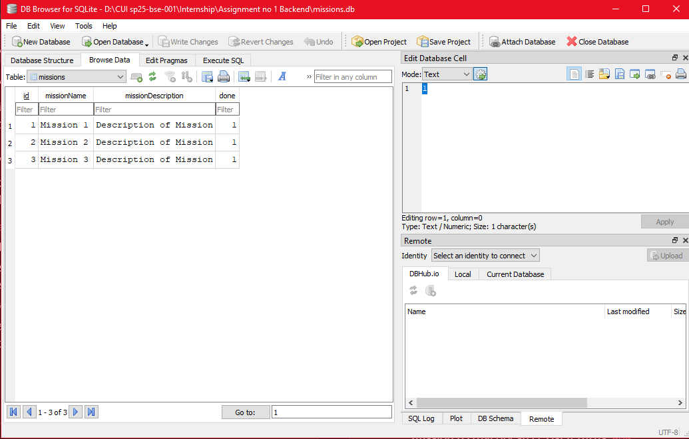

# Mission API

A CRUD API built for FlyRank Internship — Backend Track. Started in Week 2 (Assignment A1) as an in-memory API, and upgraded in Week 3 (Assignment A2) to store data in a real SQLite database. Built with Node.js and Express.

## What this is

This API lets a client create, read, update, and delete mission records through standard REST endpoints. Data is now stored in a SQLite database file (`missions.db`), so it survives server restarts — earlier (Assignment A1), it lived only in a JavaScript array in memory and was lost on every restart.

## Why SQLite

SQLite was chosen because it's a single file with zero setup — no separate database server to install, configure, or run. The entire database is just `missions.db`, created automatically the first time the app runs. This makes it ideal for a small project like this: simple to reason about, easy to inspect directly, and it gives real persistence without any infrastructure overhead.

## Where the database lives

- The database file is `missions.db`, created automatically the first time you run the server (if it doesn't already exist).
- It is **git-ignored** (see `.gitignore`) — each fresh clone of this repo starts with no database file, and one is generated automatically with 3 seeded example missions on first run.

## How to install & run

1. Clone this repo and move into the project folder:
   ```bash
   git clone https://github.com/basit-shahid/Flyrank-Assignment-no-1.git
   cd Flyrank-Assignment-no-1
   ```
2. Install dependencies:
   ```bash
   npm install
   ```
3. Start the server:
   ```bash
   node server.js
   ```
4. The API is now running at:
   ```
   http://localhost:3000
   ```
   On first run, `missions.db` is created automatically with 3 seeded example missions. Restarting the server does not duplicate them.

## Endpoints

| Method | Path             | Description                          | Success | Errors        |
|--------|------------------|--------------------------------------|---------|---------------|
| GET    | `/`              | API info (name, version, endpoints)  | 200     | —             |
| GET    | `/health`        | Health check                         | 200     | —             |
| GET    | `/missions`      | List all missions                    | 200     | —             |
| GET    | `/missions/:id`  | Get a single mission by ID           | 200     | 404           |
| POST   | `/missions`      | Create a new mission                 | 201     | 400           |
| PUT    | `/missions/:id`  | Update a mission's name/description/done | 200 | 400, 404      |
| DELETE | `/missions/:id`  | Delete a mission                     | 204     | 404           |

### Request body examples

**POST /missions**
```json
{ "missionName": "Buy milk", "missionDescription": "Get 2% milk" }
```

**PUT /missions/:id** (any combination of fields)
```json
{ "missionDescription": "Updated description", "done": true }
```

## Example curl output

```
$ curl -i -X POST http://localhost:3000/missions -H "Content-Type: application/json" -d "@mission.json"

HTTP/1.1 201 Created
X-Powered-By: Express
Content-Type: application/json; charset=utf-8
Content-Length: 69

{"id":4,"missionName":"Mission 4","missionDescription":null,"done":0}
```

## Swagger UI

Interactive API docs are available at:
```
http://localhost:3000/docs
```

Every endpoint can be tested directly from this page using "Try it out."

### CRUD verification

The complete CRUD cycle was tested through Swagger UI:

- Created `Swagger Test Mission` with `201 Created`
- Listed the mission with `200 OK`
- Updated its description with `200 OK`
- Deleted it with `204 No Content`
- Confirmed it no longer appeared in the mission list

<p align="center">
   
</p>

## Database schema

The `missions` table has 4 columns:

| Column               | Type    | Notes                              |
|----------------------|---------|-------------------------------------|
| id                   | INTEGER | Primary key, auto-incremented       |
| missionName          | TEXT    | Required                            |
| missionDescription   | TEXT    | Optional                            |
| done                 | INTEGER | 0 = not done, 1 = done (SQLite has no native boolean type, so this is stored as 0/1) |

**Database open in DB Browser for SQLite:**

<p align="center">
   
</p>

## Exploring SQLite directly (Stage 4)

I ran the following query directly in DB Browser for SQLite's "Execute SQL" tab:

```sql
UPDATE missions SET done = 1;
```

This marked all 3 seeded missions as complete. Immediately after, with no server restart, calling `GET /missions` through the API showed `done: 1` for every mission — proving the API and DB Browser read the exact same underlying file, with no separate syncing step involved.

## The mortality experiment

**Assignment A1 (in-memory):** missions were stored only in memory (a plain array in `server.js`), so any missions created, updated, or deleted while the server was running were lost the moment the server restarted — it reloaded the file from scratch and reset to the original 3 starter missions.

**Assignment A2 (SQLite):** this is now fixed. Missions are stored in `missions.db`, a real database file on disk. Creating a mission, restarting the server, and then listing missions again shows the created mission is still there — persistence achieved by moving storage from memory to disk.

## Notes on changes from Assignment 1

- My original Assignment 1 data didn't include a `done` field. I added it back in for Assignment 2, since a to-do-style list should support marking items as complete.
- All SQL queries use parameterized placeholders (`?`) rather than gluing values into the SQL string, to keep the database safe from malformed or malicious input.

## Tech stack

- Node.js
- Express
- better-sqlite3 (SQLite database)
- swagger-ui-express (API documentation)

## Notes

- The database and its table are created automatically if missing; 3 example missions are seeded only on the very first run (an empty-table check prevents re-seeding on every restart).
- Input validation is enforced on `POST` and `PUT`: an empty/missing `missionName` returns `400`, and requesting a mission ID that doesn't exist returns `404`.