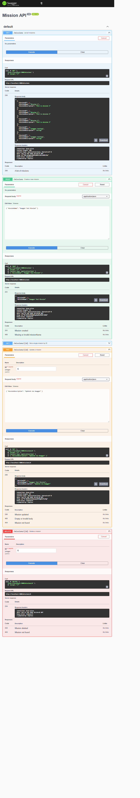

# Mission API

A small CRUD API built for FlyRank Internship — Backend Track, Week 2, Assignment A1. It manages a list of "missions" (create, read, update, delete), with data stored in memory (no database yet). Built with Node.js and Express.

## What this is

This API lets a client create, read, update, and delete mission records through standard REST endpoints. Data lives only in a JavaScript array in the server's memory — it resets to the 3 starter missions every time the server restarts.

## How to install & run

1. Clone this repo and move into the project folder:
   ```bash
   git clone https://github.com/basit-shahid/Flyrank-Assignment-no-1.git
   cd Flyrank-Assignment-no-1
   ```
2. Install dependencies:
   ```bash
   npm install
   ```
3. Start the server:
   ```bash
   node server.js
   ```
4. The API is now running at:
   ```
   http://localhost:3000
   ```

## Endpoints

| Method | Path             | Description                          | Success | Errors        |
|--------|------------------|--------------------------------------|---------|---------------|
| GET    | `/`              | API info (name, version, endpoints)  | 200     | —             |
| GET    | `/health`        | Health check                         | 200     | —             |
| GET    | `/missions`      | List all missions                    | 200     | —             |
| GET    | `/missions/:id`  | Get a single mission by ID           | 200     | 404           |
| POST   | `/missions`      | Create a new mission                 | 201     | 400           |
| PUT    | `/missions/:id`  | Update a mission's name/description  | 200     | 400, 404      |
| DELETE | `/missions/:id`  | Delete a mission                     | 204     | 404           |

### Request body examples

**POST /missions**
```json
{ "missionName": "Buy milk", "missionDescription": "Get 2% milk" }
```

**PUT /missions/:id** (either field, or both)
```json
{ "missionDescription": "Updated description" }
```

## Example curl output

```
$ curl -i -X POST http://localhost:3000/missions -H "Content-Type: application/json" -d "@mission.json"

HTTP/1.1 201 Created
X-Powered-By: Express
Content-Type: application/json; charset=utf-8
Content-Length: 41

{"missionID":4,"missionName":"Mission 4"}
```

## Swagger UI

Interactive API docs are available at:
```
http://localhost:3000/docs
```

Every endpoint can be tested directly from this page using "Try it out."



## The mortality experiment

Because missions are stored only in memory (a plain array in `server.js`), any missions created, updated, or deleted while the server is running are lost the moment the server restarts — it reloads the file from scratch and resets to the original 3 starter missions.

This happened during testing: creating a mission (e.g. mission ID 4 or 5), then restarting the server to load new routes, caused those missions to disappear, and the list returned to just the 3 originals. This is expected behavior, not a bug — it's the reason a real database (coming in Week 3) exists: to persist data across restarts instead of keeping it only in RAM.

## Tech stack

- Node.js
- Express
- swagger-ui-express (API documentation)

## Notes

- No database is used yet — all data is in-memory and non-persistent by design (see "mortality experiment" above).
- Input validation is enforced on `POST` and `PUT`: an empty/missing `missionName` returns `400`, and requesting a mission ID that doesn't exist returns `404`.
- 
